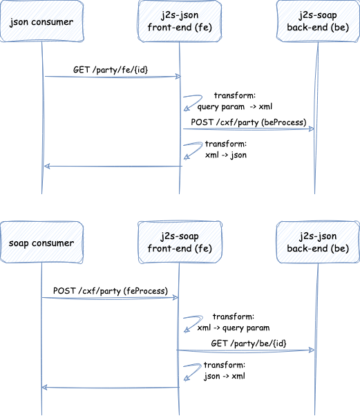
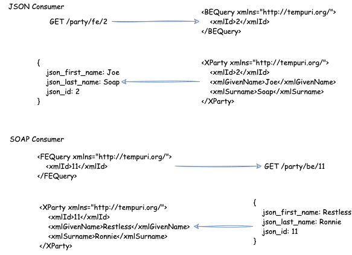

# JSON-to-SOAP and SOAP-to-JSON

A simple multi module project to show how standard Java EE API's (JAX-WS and JAX-RS) can be combined with
Apache Camel to build solutions that convert between wire formats.

The repository contains the following modules:

* ___j2s-metadata___ - This module defines the models for both a REST service and SOAP Web Service.  Defining the 
  models in a separate module allows for reuse. The classes can be used to create server and client 
  implementations of either service model.
* ___j2s-json___ - Defines a REST server implementation based on the model defined in the metadata module.
  A SOAP Web Service client is also defined to faciliate interaction with the SOAP web service.
* ___j2s-soap___ - Defines a SOAP Web Service server implementation based on the model defined in the metadata module.
  A REST client is also defined to facilitate interaction with the REST service.

The sequence diagrams below show the interaction between consumers and the server implementations. It also shows that
the front-end (fe) operations are delegated to Apache Camel to interact with a back-end (be) service that implements 
a different wire format from the one expected by the consumer.

The diagram below shows the transformations that take place in each consumer scenario. For this example, the shape
of the messages were not aligned on purpose. This is to showcase the flexibility Apache Camel offers when
implementing data transformations.

